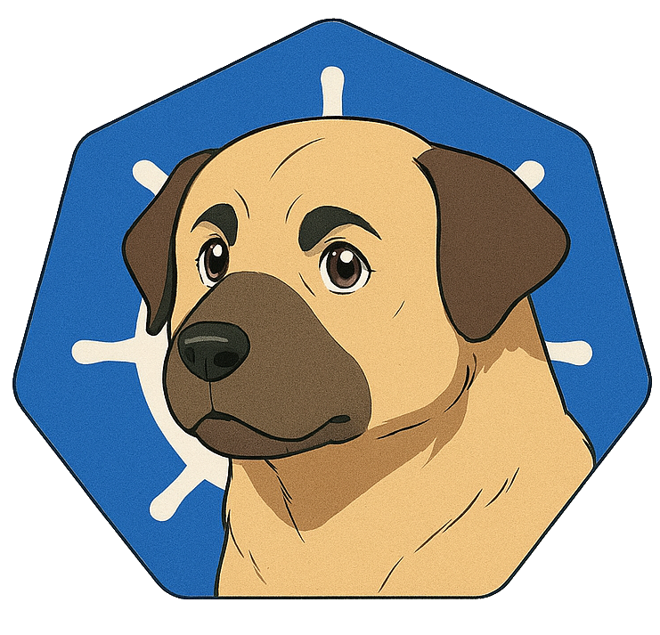

<div align="center"></div>

## Purpose

KangalPatch automates rolling upgrades of Talos Linux nodes in Kubernetes clusters. The operator handles node draining, OS updates, reboots, and readiness checks while respecting PodDisruptionBudgets and failure thresholds.

Key features:
- Controlled concurrent node upgrades
- Automatic workload draining with PDB enforcement
- Configurable failure budgets with automatic halt on threshold breach
- Maintenance window support with date exclusions
- Pause and resume support for manual intervention
- Real-time upgrade status tracking

## How it works

The operator watches PatchPlan resources. When you create one, it:
1. Selects nodes based on labels and role
2. For each node: drain → upgrade → reboot → verify
3. Respects your concurrency, timing, and failure settings

If failures exceed your threshold, it stops automatically.

## Quick Start

### Prerequisites

- Kubernetes cluster running Talos Linux
- `kubectl` configured to access your cluster
- Helm 3.x (for Helm installation)

### Installation via Helm

```bash
# Install KangalPatch
helm install kangal-patch oci://ghcr.io/uozalp/helm/kangal-patch \
  --version 0.1.2 \
  --namespace kangal-patch \
  --create-namespace
```

### Installation via kubectl

```bash
# Install CRDs
kubectl apply -k config/crd

# Install RBAC and operator
kubectl apply -k config/manager
```

## Usage

### 1. Create Talos Credentials Secret

First, create a secret containing your Talos API credentials:

```bash
# Extract credentials from your talosconfig (typically ~/.talos/config)

# Encode credentials to base64
CA_CERT=$(base64 -w0 < /path/to/ca.crt)
CLIENT_CERT=$(base64 -w0 < /path/to/client.crt)
CLIENT_KEY=$(base64 -w0 < /path/to/client.key)

# Create the secret with base64-encoded values
kubectl create secret generic talos-credentials \
  --namespace kangal-patch \
  --from-literal=ca.crt="$CA_CERT" \
  --from-literal=tls.crt="$CLIENT_CERT" \
  --from-literal=tls.key="$CLIENT_KEY"
```

### 2. Create a PatchPlan

Create a `PatchPlan` custom resource to define your upgrade:

```yaml
apiVersion: kangalpatch.ozalp.dk/v1alpha1
kind: PatchPlan
metadata:
  name: simple-upgrade
spec:
  target:
    talosVersion: v1.11.6
    source: ghcr
  
  # Patch workers first, then control plane
  patchWorkers: true
  patchControlPlane: true
  controlPlaneFirst: false
  
  # Batch configuration
  maxConcurrency: 1
  
  # Timing
  delayBetweenNodes: 300s
  
  # Safety
  respectPDBs: true
  drainTimeout: 5m
  rebootTimeout: 10m
  maxFailures: 1
  
  # Talos API
  talosConfig:
    endpoints:
      - 10.0.0.10:50000
    secretRef:
      name: talos-credentials
      namespace: kangal-patch
```

**Example using Talos Factory images:**

The `target` specification uses individual fields to construct the factory image URL. The operator builds the full URL in the format:
```
factory.talos.dev/{installer}-installer[-secureboot]/{schematicID}:{talosVersion}
```

Field breakdown:
```yaml
target:
  talosVersion: v1.11.6               # The Talos version tag
  source: factory                     # Use factory.talos.dev (vs ghcr)
  installer: nocloud                  # The installer type (aws, azure, nocloud, etc.)
  schematicID: 95d432d6bb...          # Optional: omit to keep each node's current schematic
  secureBoot: true                    # Adds -secureboot suffix to installer
```

Full example:

```yaml
apiVersion: kangalpatch.ozalp.dk/v1alpha1
kind: PatchPlan
metadata:
  name: talos-upgrade-factory
spec:
  target:
    talosVersion: v1.12.1
    source: factory
    installer: aws
    schematicID: 376567988ad370138ad8b2698212367b8edcb69b5fd68c80be1f2ec7d603b4ba
    secureBoot: true
  
  patchWorkers: true
  patchControlPlane: true
  maxConcurrency: 2
  
  talosConfig:
    endpoints:
      - 10.0.0.10:50000
    secretRef:
      name: talos-credentials
      namespace: kangal-patch
```

Apply the PatchPlan:

```bash
kubectl apply -f patchplan.yaml
```

### 3. Optional: Configure Maintenance Windows

Restrict patching to specific time windows and exclude certain dates:

```yaml
apiVersion: kangalpatch.ozalp.dk/v1alpha1
kind: PatchPlan
metadata:
  name: talos-upgrade-maintenance
spec:
  target:
    talosVersion: v1.11.6
    source: ghcr
  
  # ... other configuration ...
  
  # Maintenance windows
  maintenance:
    # Exclude specific dates (holidays, blackout periods)
    excludeDates:
      - "2026-12-24"
      - "2026-12-25"
      - "2026-12-26"
      - "2026-12-31"
      - "2027-01-01"
    
    # Define when patching is allowed (UTC)
    windows:
      # Monday and Friday early morning
      - days: ["Monday", "Friday"]  # Supports: "Monday", "Mon", "monday"
        startTime: "01:00"
        endTime: "05:00"
      
      # Wednesday night window
      - days: ["Wed"]
        startTime: "22:00"
        endTime: "02:00"  # Spans midnight
      
      # Every day window (omit days field or use ["Any"])
      - startTime: "03:00"
        endTime: "04:00"
```

**Notes on maintenance windows:**
- All times are in UTC
- Day names support full names ("Monday"), 3-letter abbreviations ("Mon"), case-insensitive
- Omit `days` field or use `["Any"]` to match all days
- Windows can span midnight (e.g., 22:00 to 02:00)
- Patching will be paused outside maintenance windows
- Exclude dates use YYYY-MM-DD format


### 4. Monitor Progress

Watch the upgrade progress:

```console
# Watch status in real-time
$ kubectl get patchplan -w

NAME             PHASE       TALOSTARGET   K8STARGET   TOTAL   COMPLETED   FAILED   AGE
simple-upgrade   Completed   v1.11.6                   6       6           0        79m

# Check individual node status
$ kubectl get patchplan simple-upgrade -o jsonpath='{.status}' | jq
{
  "completedNodes": 6,
  "completionTime": "2025-12-28T20:54:03Z",
  "failedNodes": 0,
  "lastNodeScheduledAt": "2025-12-28T20:54:03Z",
  "message": "all nodes processed",
  "phase": "Completed",
  "startTime": "2025-12-28T19:32:29Z",
  "targetTalosVersion": "v1.11.6",
  "totalNodes": 6
}
```

### 5. Pause/Resume

Pause an ongoing upgrade:

```bash
kubectl patch patchplan simple-upgrade --type merge -p '{"spec":{"paused":true}}'
```

Resume:

```bash
kubectl patch patchplan simple-upgrade --type merge -p '{"spec":{"paused":false}}'
```

### 6. Cancel

Unlike pause, cancelling is permanent: the PatchPlan moves to the terminal `Cancelled` phase and
the controller stops scheduling new nodes. PatchJobs already in progress are not affected and
run to completion.

```bash
kubectl patch patchplan simple-upgrade --type merge -p '{"spec":{"cancelled":true}}'
```

Setting `cancelled` back to `false` resumes scheduling, same as pause/resume.

### 7. Upgrading Across Multiple Talos Versions

Talos doesn't reliably support jumping several minor versions in a single upgrade. A large
version skip (e.g. `v1.11.x` → `v1.14.x`) can silently fail: the upgrade succeeds and the node
reboots, but it boots back into the *old* partition with no error reported anywhere. The
`PatchJob` will just look stuck, waiting for a target version that never arrives.

If you're multiple minor versions behind, upgrade in stages rather than jumping straight to the
latest version. For example, going from `v1.11.x` to `v1.14.0`:

```bash
# Stage 1: v1.11.x -> v1.13.10
kubectl apply -f - <<EOF
apiVersion: kangalpatch.ozalp.dk/v1alpha1
kind: PatchPlan
metadata:
  name: upgrade-stage-1
spec:
  target:
    talosVersion: v1.13.10
    source: ghcr
  patchWorkers: true
  patchControlPlane: true
  maxConcurrency: 1
  talosConfig:
    endpoints: ["10.0.0.10:50000"]
    secretRef: {name: talos-credentials, namespace: kangal-patch}
EOF

# Wait for upgrade-stage-1 to reach phase: Completed, then:

# Stage 2: v1.13.10 -> v1.14.0
kubectl apply -f - <<EOF
apiVersion: kangalpatch.ozalp.dk/v1alpha1
kind: PatchPlan
metadata:
  name: upgrade-stage-2
spec:
  target:
    talosVersion: v1.14.0
    source: ghcr
  patchWorkers: true
  patchControlPlane: true
  maxConcurrency: 1
  talosConfig:
    endpoints: ["10.0.0.10:50000"]
    secretRef: {name: talos-credentials, namespace: kangal-patch}
EOF
```

**Spotting a stuck upgrade:** `kubectl get patchjob` shows a job stuck in the `Rebooting` phase
with `currentTalosVersion` unchanged from before the upgrade, even though `kubectl get nodes` reports
the node as `Ready` again. Confirm the actual installed version via the node's `OS-IMAGE` column
(`kubectl get nodes -o wide`) or `talosctl -n <node-ip> version`, then retry with an intermediate
version as shown above.

### 8. Kubernetes Version Compatibility

Not every Kubernetes version runs on every Talos version. Before setting `target.kubernetesVersion`,
check the official Talos support matrix for the Talos version your nodes are running:
**https://docs.siderolabs.com/talos/\<talos-version\>/getting-started/support-matrix**

As of this writing, the supported combinations are:

| Talos version | Supported Kubernetes versions |
|---|---|
| [1.14](https://docs.siderolabs.com/talos/v1.14/getting-started/support-matrix) | 1.37, 1.36, 1.35, 1.34, 1.33 |
| [1.13](https://docs.siderolabs.com/talos/v1.13/getting-started/support-matrix) | 1.36, 1.35, 1.34, 1.33, 1.32, 1.31 |
| [1.12](https://docs.siderolabs.com/talos/v1.12/getting-started/support-matrix) | 1.35, 1.34, 1.33, 1.32, 1.31, 1.30 |
| [1.11](https://docs.siderolabs.com/talos/v1.11/getting-started/support-matrix) | 1.34, 1.33, 1.32, 1.31, 1.30, 1.29 |
| [1.10](https://docs.siderolabs.com/talos/v1.10/getting-started/support-matrix) | 1.33, 1.32, 1.31, 1.30, 1.29, 1.28 |

This table goes stale with every new Talos/Kubernetes release, so always check the link above for
the current matrix rather than relying on the snapshot here. Before scheduling any node, the
preflight checks (see [Preflight Checks](#preflight-checks)) reject a `target.kubernetesVersion`
that's outside the range in a built-in copy of this table. Talos versions newer than the built-in
table are not checked.

### Auto-Update

Instead of naming a Talos version, a PatchPlan can follow the upstream
[siderolabs/talos releases](https://github.com/siderolabs/talos/releases). With
`target.autoUpdate.enabled: true` the PatchPlan is a template (phase `Watching`) that never patches
nodes itself. Every `checkInterval` it creates a child PatchPlan named `<template>-<version>` with
`target.talosVersion` set and the rest of the spec copied, and that child runs the normal flow
(preflight, `PatchJobs`). Each release therefore has its own PatchPlan and history.

```yaml
spec:
  target:
    autoUpdate:
      enabled: true
      allow: patch          # patch (default) | minor
      checkInterval: 30m    # default 1h, minimum 1m
      minReleaseAge: 72h    # default 0s
```

- The current version is the lowest Talos version across the selected nodes. `allow: patch` only
  moves within the current minor; `allow: minor` also steps to the next minor, never skipping one.
- Only stable GitHub releases are considered, and a release must be at least `minReleaseAge` old.
- No new child is created while an earlier child is not `Completed` (including `Failed`); delete or
  fix it to resume. Children are garbage-collected with the template.
- `talosVersion` and `kubernetesVersion` must be omitted on a template. Releases are read
  anonymously from the GitHub API.
- `status.autoUpdate` shows the last check, the current, latest and pending (too young) versions,
  and the last created plan.

```bash
kubectl get patchplan
```

### Preflight Checks

Before the first `PatchJob` of a `PatchPlan` is created, the controller runs these checks once
(phase `Preflighting`) and schedules nothing until all pass:

- the node selection resolves to at least one node
- no other `InProgress` or `Paused` PatchPlan targets any of the same nodes (auto-update templates are ignored)
- the Kubernetes API reports ready (`/readyz`)
- the Talos credentials work against the configured endpoints, and every selected node answers on the Talos API
- the Talos installer image exists in the registry for nodes that still need the upgrade
- `target.kubernetesVersion` is supported by the target (or, if unset, the current) Talos version

On failure the plan moves to `Failed`, the `PreflightPassed` condition carries the reason and
message, and the checks are retried every minute, so fixing the cause (e.g. a Secret) recovers the
plan without recreating it. Checks are not repeated once `PatchJobs` exist.

```bash
kubectl get patchplan simple-upgrade -o jsonpath='{.status.conditions}' | jq
```

## Configuration Reference

### PatchPlan Spec

| Field | Type | Description | Default |
|-------|------|-------------|---------|
| `target` | object | Target Talos and/or Kubernetes version specification | Required |
| `nodeSelector` | map | Label selector for nodes | `{}` |
| `maxConcurrency` | int | Max nodes to patch concurrently | `1` |
| `maxFailures` | int | Max allowed failures before stopping | `0` |
| `delayBetweenNodes` | duration | Delay between nodes | `5m` |
| `respectPDBs` | bool | Respect PodDisruptionBudgets | `true` |
| `drainTimeout` | duration | Max time for node drain | `5m` |
| `rebootTimeout` | duration | Max time for reboot | `10m` |
| `patchControlPlane` | bool | Patch control plane nodes | `true` |
| `patchWorkers` | bool | Patch worker nodes | `true` |
| `controlPlaneFirst` | bool | Patch control plane first | `false` |
| `paused` | bool | Pause operation | `false` |
| `cancelled` | bool | Permanently cancel operation | `false` |
| `maintenance` | object | Maintenance window configuration | `nil` |

#### Target Spec

At least one of `talosVersion`/`kubernetesVersion` (or an enabled `autoUpdate`) must be set; both
can be set to upgrade both
in the same PatchPlan. Setting `kubernetesVersion` requires `controlPlaneFirst` and
`patchControlPlane` to be `true`, since a kubelet must never run newer than the control plane it
connects to.

| Field | Type | Description | Default |
|-------|------|-------------|---------|
| `talosVersion` | string | Talos OS version (e.g., v1.12.1) | - |
| `kubernetesVersion` | string | Kubernetes version (e.g., v1.32.4). Patches the kubelet and, on control plane nodes, the kube-apiserver/controller-manager/scheduler static pods and the cluster-wide kube-proxy DaemonSet. No drain/reboot required | - |
| `source` | string | Image source: "ghcr" or "factory" | `ghcr` |
| `installer` | string | Installer type (e.g., "aws", "nocloud"). Required when source=factory | - |
| `schematicID` | string | Talos factory schematic ID. If omitted with source=factory, each node's currently running schematic is used | - |
| `secureBoot` | bool | Enable secure boot. Only applicable when source=factory | `false` |
| `autoUpdate.enabled` | bool | Make the plan an auto-update template, see [Auto-Update](#auto-update) | - |
| `autoUpdate.allow` | string | Largest automatic change: `patch` or `minor` | `patch` |
| `autoUpdate.checkInterval` | duration | How often to check for releases (min 1m) | `1h` |
| `autoUpdate.minReleaseAge` | duration | Minimum age of a release before it is used | `0s` |

#### Maintenance Spec

| Field | Type | Description |
|-------|------|-------------|
| `excludeDates` | []string | List of dates (YYYY-MM-DD) to exclude from patching |
| `windows` | []MaintenanceWindow | List of time windows when patching is allowed |

#### MaintenanceWindow

| Field | Type | Description |
|-------|------|-------------|
| `days` | []string | Days of week (e.g., "Monday", "Mon"). Empty = all days |
| `startTime` | string | Start time in HH:MM format (UTC) |
| `endTime` | string | End time in HH:MM format (UTC) |
| `disabled` | bool | Temporarily disable this window |

## Development

### Building from Source

```bash
# Build the binary
make build

# Run tests
make test

# Build Docker image
make docker-build IMG=ghcr.io/uozalp/kangal-patch:dev

# Generate manifests
make manifests

# Generate code
make generate
```

## Contributing

Contributions are welcome! Please feel free to submit a Pull Request.

## License

This project is licensed under the MIT License - see the [LICENSE](LICENSE) file for details.