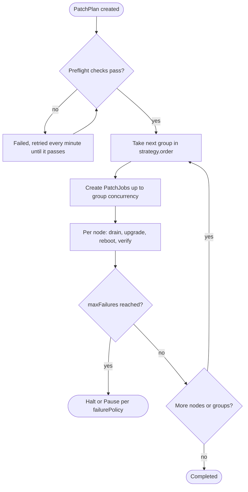

<div align="center">
  

  <h1>KangalPatch</h1>

  <p><strong>A Kubernetes operator for safe, rolling upgrades of Talos Linux clusters.</strong></p>

  <p>
    <a href="LICENSE">MIT License</a> ·
    <a href="#quick-start">Quick Start</a> ·
    <a href="#configuration-reference">Configuration Reference</a> ·
    <a href="#troubleshooting">Troubleshooting</a>
  </p>
</div>

---

## Table of Contents

- [Overview](#overview)
- [Features](#features)
- [Concepts](#concepts)
- [Quick Start](#quick-start)
- [Usage](#usage)
- [Operations Guide](#operations-guide)
- [Configuration Reference](#configuration-reference)
- [Examples](#examples)
- [Troubleshooting](#troubleshooting)
- [Uninstalling](#uninstalling)
- [Development](#development)
- [Contributing](#contributing)
- [License](#license)

## Overview

KangalPatch automates rolling upgrades of Talos Linux nodes and the Kubernetes components running
on them. For every node it handles draining, the OS upgrade, the reboot and the readiness checks,
while respecting PodDisruptionBudgets and the failure thresholds you configure.

You describe the desired state in a `PatchPlan`; the operator works out which nodes are affected,
runs preflight checks, and rolls the change out group by group.

## Features

- **Rolling Talos OS upgrades** with per-group concurrency limits
- **Kubernetes version upgrades** (kubelet, control plane static pods, kube-proxy) without reboots
- **Rollout groups and ordering** to patch databases, GPU nodes, workers and control plane in the order you choose
- **Safe draining** with PodDisruptionBudget enforcement
- **Preflight checks** that block a rollout before any node is touched
- **Failure budgets** that halt or pause the rollout when a threshold is reached
- **Maintenance windows** with date exclusions
- **Auto-update** that follows upstream Talos releases, with a minimum release age
- **Pause, resume and cancel** for manual intervention
- **Live status tracking** per plan, group and node
- **Automatic cleanup** of finished `PatchJobs` after a retention period

## Concepts

| Resource | Scope | Description |
|----------|-------|-------------|
| `PatchPlan` | Cluster | Declares the target versions, node selection, rollout order, safety settings and schedule. This is the only resource you create. |
| `PatchJob` | Cluster | Created by the operator, one per node. Tracks that node through its upgrade. |

A `PatchPlan` is the rollout definition and its orchestration state. It creates a `PatchJob` for each
node it schedules, and each `PatchJob` moves that single node through the upgrade state machine.

```
PatchPlan
  +-- PatchJob / node-1
  +-- PatchJob / node-2
  +-- PatchJob / node-3
  +-- PatchJob / node-4
```

### How it works



1. The operator selects the nodes named by `nodeSelector` and assigns each to the first matching
   group in `strategy.order`.
2. Preflight checks run once. Nothing is scheduled until they all pass.
3. For each node: cordon and drain → Talos upgrade → reboot → verify (and, if requested, patch
   the Kubernetes components and validate them).
4. Per-group concurrency, timing and failure settings are enforced throughout.
5. If failures exceed the threshold, the plan halts or pauses according to `failurePolicy`.

#### PatchPlan phases

| Phase | Meaning |
|-------|---------|
| `Pending` | Created, waiting to start |
| `Preflighting` | Running preflight checks |
| `InProgress` | Nodes are being patched |
| `Paused` | Paused by `spec.paused` or by the `Pause` failure policy |
| `Cancelled` | Scheduling stopped by `spec.cancelled`. Not requeued; setting `cancelled` back to `false` resumes the plan |
| `Completed` | All nodes processed |
| `Failed` | Either preflight failed (not terminal: retried every minute, recovers once fixed) or the `Halt` failure threshold was reached (terminal) |
| `Watching` | Auto-update template that spawns child plans |

#### PatchJob phases

`Pending` → `Draining` → `Upgrading` → `Rebooting` → `UpgradingKubernetes` → `ValidatingKubernetes` → `Completed` (or `Failed`).
Kubernetes phases only apply when `target.kubernetesVersion` is set.

## Quick Start

### Prerequisites

- A Kubernetes cluster running Talos Linux
- `kubectl` configured for the cluster
- Helm 3.x (for Helm installation)
- Client credentials for the Talos API (CA certificate, client certificate and key)

### Install with Helm

```bash
helm install kangal-patch oci://ghcr.io/uozalp/helm/kangal-patch \
  --version 0.1.2 \
  --namespace kangal-patch \
  --create-namespace
```

Chart settings (replicas, resources, leader election, RBAC) are documented in
[helm/kangal-patch/values.yaml](helm/kangal-patch/values.yaml). Two replicas with leader election are the default.

### Install with kubectl

```bash
# CRDs
kubectl apply -k config/crd

# RBAC and operator
kubectl apply -k config/manager
```

### Verify the installation

```bash
kubectl -n kangal-patch get pods
kubectl get crd patchplans.kangalpatch.ozalp.dk patchjobs.kangalpatch.ozalp.dk
```

## Usage

### 1. Create the Talos credentials Secret

The operator reads the Talos API credentials from a Secret in the operator namespace. Each key
holds the **base64-encoded PEM** value, which is the same encoding used in a `talosconfig` file, so
the values can be copied from it directly.

```bash
CA_CERT=$(base64 -w0 < /path/to/ca.crt)
CLIENT_CERT=$(base64 -w0 < /path/to/client.crt)
CLIENT_KEY=$(base64 -w0 < /path/to/client.key)

kubectl create secret generic talos-credentials \
  --namespace kangal-patch \
  --from-literal=ca.crt="$CA_CERT" \
  --from-literal=tls.crt="$CLIENT_CERT" \
  --from-literal=tls.key="$CLIENT_KEY"
```

A manifest example is available in [config/samples/talos-secret-example.yaml](config/samples/talos-secret-example.yaml).

> [!WARNING]
> These credentials grant full administrative access to the Talos API. Restrict access to the
> Secret with RBAC and consider an external secret manager.

### 2. Create a PatchPlan

```yaml
apiVersion: kangalpatch.ozalp.dk/v1alpha1
kind: PatchPlan
metadata:
  name: simple-upgrade
spec:
  target:
    talosVersion: v1.11.6
    source: factory
    installer: nocloud

  # Control plane first, then workers (this is the default order)
  strategy:
    order: [controlPlane, workers]

  # How many nodes of a group are patched at once
  groups:
    controlPlane:
      concurrency: 1
    workers:
      concurrency: 1

  # Timing
  delayBetweenNodes: 300s

  # Safety
  respectPDBs: true
  drainTimeout: 5m
  rebootTimeout: 10m
  failurePolicy:
    type: Halt
    maxFailures: 1

  # Talos API
  talosConfig:
    endpoints:
      - 10.0.0.10:50000
    secretRef:
      name: talos-credentials
      namespace: kangal-patch
```

```bash
kubectl apply -f patchplan.yaml
```

#### Talos installer source

`target.source` controls how the installer image is resolved.

| `source` | Installer image | Use for |
|----------|-----------------|---------|
| `factory` | `factory.talos.dev/{installer}-installer[-secureboot]/{schematicID}:{talosVersion}` | Recommended. Required for Talos 1.14 and later. Supports schematics and secure boot |
| `ghcr` (default) | `ghcr.io/siderolabs/installer:{talosVersion}` | Legacy: Talos releases before 1.14 that do not need a custom schematic |

> [!NOTE]
> Since Talos 1.14.0 the default installer image is served by Image Factory and
> `ghcr.io/siderolabs/installer` is no longer published with releases. `ghcr` is retained for older
> Talos versions; for Talos 1.14 and later set `source: factory`. The preflight registry check fails
> a plan whose installer image does not exist.

With `source: factory`, `installer` is required (`aws`, `azure`, `nocloud`, ...).

**Without `schematicID`: keep each node's schematic.** The operator detects the schematic each node
is currently running and uses it for that node's installer image, so a version upgrade does not
lose the node's system extensions or kernel arguments.

```yaml
spec:
  target:
    talosVersion: v1.12.1
    source: factory
    installer: nocloud
```

**With `schematicID`: set the target schematic.** The given schematic is used for every node. This
can intentionally change the extensions and customization of the Talos image.

```yaml
spec:
  target:
    talosVersion: v1.12.1
    source: factory
    installer: aws
    schematicID: 376567988ad370138ad8b2698212367b8edcb69b5fd68c80be1f2ec7d603b4ba
    secureBoot: true                  # adds the -secureboot suffix
  groups:
    workers:
      concurrency: 2
  talosConfig:
    endpoints:
      - 10.0.0.10:50000
    secretRef:
      name: talos-credentials
      namespace: kangal-patch
```

### 3. Monitor progress

```console
$ kubectl get patchplan -w
NAME             PHASE       TALOSTARGET   K8STARGET   TOTAL   RUNNING   COMPLETED   FAILED   AGE
simple-upgrade   Completed   v1.11.6                   6       0         6           0        79m

$ kubectl get patchjob
$ kubectl get patchplan simple-upgrade -o jsonpath='{.status}' | jq
{
  "completedNodes": 6,
  "completionTime": "2025-12-28T20:54:03Z",
  "failedNodes": 0,
  "lastNodeScheduledAt": "2025-12-28T20:54:03Z",
  "message": "all nodes processed",
  "phase": "Completed",
  "startTime": "2025-12-28T19:32:29Z",
  "targetTalosVersion": "v1.11.6",
  "totalNodes": 6
}
```

### 4. Pause, resume and cancel

Pause and resume:

```bash
kubectl patch patchplan simple-upgrade --type merge -p '{"spec":{"paused":true}}'
kubectl patch patchplan simple-upgrade --type merge -p '{"spec":{"paused":false}}'
```

Cancel:

```bash
kubectl patch patchplan simple-upgrade --type merge -p '{"spec":{"cancelled":true}}'
```

A cancelled plan moves to the `Cancelled` phase and the controller stops scheduling new nodes.
Unlike pause, the plan is not requeued, and `PatchJobs` already in progress are not interrupted and
run to completion. Cancelling is not enforced as irreversible: setting `cancelled` back to `false`
resumes scheduling. To stop for good, delete the plan.

## Operations Guide

### Maintenance windows

Restrict patching to specific time windows and exclude certain dates:

```yaml
spec:
  maintenance:
    excludeDates:             # holidays, blackout periods (YYYY-MM-DD)
      - "2026-12-24"
      - "2026-12-25"
      - "2026-12-31"

    windows:                  # when patching is allowed (UTC)
      - days: ["Monday", "Friday"]
        startTime: "01:00"
        endTime: "05:00"

      - days: ["Wed"]
        startTime: "22:00"
        endTime: "02:00"      # spans midnight

      - startTime: "03:00"    # every day
        endTime: "04:00"
```

- All times are UTC.
- Day names accept full names or 3-letter abbreviations, case-insensitive.
- Omit `days` or use `["Any"]` to match every day.
- Windows may span midnight.
- Patching pauses outside the windows and on excluded dates.

### Rollout groups, strategy and concurrency

A group is a logical **rollout group**: a named label selector that decides when its nodes are
patched. It is not a Kubernetes node group or node pool, and exists only inside the `PatchPlan`.

`nodeSelector` defines the complete population of a plan. `groups` are label filters over that
population and never add nodes; they may overlap. `strategy.order` lists the groups from first to
last and resolves overlaps: **the first listed group a node matches schedules it, and a node is
patched at most once per plan**. Groups that are not listed in `strategy.order` do not take part in
the rollout. `workers` (non-control-plane nodes) and `controlPlane` are built in and need not be
declared.

```yaml
spec:
  nodeSelector:
    matchLabels:
      environment: production
  groups:
    database:
      selector:
        matchLabels: {workload: database}
      concurrency: 1
    kafka:
      selector:
        matchLabels: {workload: kafka}
      concurrency: 1
    gpu:
      selector:
        matchLabels: {accelerator: nvidia}
      concurrency: 2
    workers:        # built in, declared only to set its concurrency
      concurrency: 3
  strategy:
    order: [database, kafka, gpu, workers, controlPlane]
  failurePolicy:
    type: Halt
    maxFailures: 1
  retention:
    history: 168h
```

- Groups run strictly in `strategy.order`: a group starts once every earlier group has finished.
  Without `strategy.order` the order is `[controlPlane, workers]`.
- Selected nodes that no listed group claims are not patched. Omit `workers` (or `controlPlane`) to
  leave those nodes alone.
- `concurrency` is per group and enforced with Leases. Every active `PatchJob` holds one Lease in
  the operator namespace, labelled `kangalpatch.ozalp.dk/patchplan` and `kangalpatch.ozalp.dk/group`,
  from creation until the job is `Completed` or `Failed`. The live concurrency of a group is its
  number of Leases:
  ```bash
  kubectl -n kangal-patch get lease \
    -l kangalpatch.ozalp.dk/patchplan=<plan>,kangalpatch.ozalp.dk/group=<group>
  ```
- `delayBetweenNodes` is the minimum time between two scheduling rounds; a round fills all free
  slots of the current group.
- `failurePolicy` is independent of concurrency and triggers once `maxFailures` (default `1`) nodes
  have failed.
  - `Halt` (default) marks the plan `Failed`.
  - `Pause` sets `spec.paused: true` so you can inspect the failed `PatchJobs`, delete one to have
    its node retried, then set `paused: false` to resume. Resuming accepts the failures seen so far
    (`status.failuresAcknowledged`); the plan pauses again after `maxFailures` further failures.
  - Running nodes are never interrupted.
- `retention.history` (default `168h`): once the plan has completed, failed or been cancelled, its
  finished `PatchJobs` are removed after this time, provided none is still running. The plan is
  frozen afterwards (`status.historyPurged`); create a new `PatchPlan` to roll out again.
- Status reports `totalNodes`, `pendingNodes`, `runningNodes`, `completedNodes`, `failedNodes` and a
  `status.groups` breakdown in schedule order.

### Preflight checks

Before the first `PatchJob` of a plan is created, the controller runs these checks once (phase
`Preflighting`) and schedules nothing until all pass:

- The node selection resolves to at least one node, and `strategy.order` is valid and claims at least one of them.
- When `target.kubernetesVersion` is set, `strategy.order` schedules every control plane node before any worker (the order is never changed for you).
- No other `InProgress` or `Paused` PatchPlan targets any of the same nodes (auto-update templates are ignored).
- The Kubernetes API reports ready (`/readyz`).
- The Talos credentials work against the configured endpoints, and every selected node answers on the Talos API.
- The Talos installer image exists in the registry for nodes that still need the upgrade.
- The Talos/Kubernetes support matrix accepts the combination every node ends up with (the target
  versions, or the version a node keeps if only the other one changes). The current combination is reported.

The resulting rollout plan (nodes and concurrency per group) is part of the `PreflightPassed`
condition message.

On failure the plan moves to `Failed`, the `PreflightPassed` condition carries the reason and
message, and the checks are retried every minute, so fixing the cause (for example a Secret)
recovers the plan without recreating it. There is no retry limit: a plan with a permanent
problem stays `Failed` and keeps retrying until you fix it, cancel it or delete it. Checks are
not repeated once `PatchJobs` exist.

```bash
kubectl get patchplan simple-upgrade -o jsonpath='{.status.conditions}' | jq
```

### Auto-update

Instead of naming a Talos version, a PatchPlan can follow the upstream
[siderolabs/talos releases](https://github.com/siderolabs/talos/releases). With
`target.autoUpdate.enabled: true` the PatchPlan is a template (phase `Watching`) that never patches
nodes itself. Every `checkInterval` it creates a child PatchPlan named `<template>-<version>` with
`target.talosVersion` set and the rest of the spec copied. The child runs the normal flow
(preflight, `PatchJobs`), so each release has its own PatchPlan and history.

```
Auto-update PatchPlan (Watching, patches no nodes itself)
  +-- child PatchPlan <template>-v1.14.1   -> PatchJobs per node
  +-- child PatchPlan <template>-v1.14.2   -> PatchJobs per node
```

Because children copy the template's `target`, set `source: factory` on templates that will
reach Talos 1.14 or later.

```yaml
spec:
  target:
    autoUpdate:
      enabled: true
      allow: patch          # patch (default) | minor
      checkInterval: 30m    # default 1h, minimum 1m
      minReleaseAge: 72h    # default 0s
```

- The current version is the lowest Talos version across the selected nodes. `allow: patch` only
  moves within the current minor; `allow: minor` also steps to the next minor, never skipping one.
- Only stable GitHub releases are considered, and a release must be at least `minReleaseAge` old.
- No new child is created while an earlier child is not `Completed` (including `Failed`); delete or
  fix it to resume. Children are garbage-collected with the template.
- `talosVersion` and `kubernetesVersion` must be omitted on a template. Releases are read
  anonymously from the GitHub API.
- `status.autoUpdate` shows the last check, the current, latest and pending (too young) versions,
  and the last created plan.

### Upgrading across multiple Talos versions

Talos does not reliably support jumping several minor versions in one upgrade. A large skip
(for example `v1.11.x` → `v1.14.x`) can fail silently: the upgrade call succeeds and the node
reboots, but it boots back into the *old* partition and no error is reported. The `PatchJob` then
appears stuck waiting for a target version that never arrives.

If you are multiple minor versions behind, upgrade in stages. For example `v1.11.x` → `v1.13.10` → `v1.14.0`:

```bash
# Stage 1: v1.11.x -> v1.13.10
kubectl apply -f - <<EOF
apiVersion: kangalpatch.ozalp.dk/v1alpha1
kind: PatchPlan
metadata:
  name: upgrade-stage-1
spec:
  target:
    talosVersion: v1.13.10
    source: factory
    installer: nocloud
  groups:
    workers: {concurrency: 1}
  talosConfig:
    endpoints: ["10.0.0.10:50000"]
    secretRef: {name: talos-credentials, namespace: kangal-patch}
EOF

# Wait for upgrade-stage-1 to reach phase Completed, then repeat with
# talosVersion: v1.14.0 as upgrade-stage-2.
```

See [Troubleshooting](#a-patchjob-is-stuck-in-rebooting) for how to recognise a stuck upgrade.

### Kubernetes version compatibility

Not every Kubernetes version runs on every Talos version. Before setting `target.kubernetesVersion`,
check the Talos support matrix for the Talos version your nodes run:
`https://docs.siderolabs.com/talos/<talos-version>/getting-started/support-matrix`

| Talos version | Supported Kubernetes versions |
|---|---|
| [1.14](https://docs.siderolabs.com/talos/v1.14/getting-started/support-matrix) | 1.37, 1.36, 1.35, 1.34, 1.33 |
| [1.13](https://docs.siderolabs.com/talos/v1.13/getting-started/support-matrix) | 1.36, 1.35, 1.34, 1.33, 1.32, 1.31 |
| [1.12](https://docs.siderolabs.com/talos/v1.12/getting-started/support-matrix) | 1.35, 1.34, 1.33, 1.32, 1.31, 1.30 |
| [1.11](https://docs.siderolabs.com/talos/v1.11/getting-started/support-matrix) | 1.34, 1.33, 1.32, 1.31, 1.30, 1.29 |
| [1.10](https://docs.siderolabs.com/talos/v1.10/getting-started/support-matrix) | 1.33, 1.32, 1.31, 1.30, 1.29, 1.28 |

This table goes stale with every release; the linked matrices are authoritative. The
[preflight checks](#preflight-checks) reject a `target.kubernetesVersion` outside the range of a
built-in copy of this table. Talos versions newer than the built-in table are not checked.

## Configuration Reference

### PatchPlan spec

| Field | Type | Description | Default |
|-------|------|-------------|---------|
| `target` | object | Target Talos and/or Kubernetes version, see [Target spec](#target-spec) | Required |
| `nodeSelector` | LabelSelector | Complete population of nodes the plan may patch | all nodes |
| `groups` | map | Rollout groups with `selector` (label selector) and `concurrency` (min 1, default 1). `workers` and `controlPlane` are built in | `{}` |
| `strategy.order` | []string | Group evaluation and rollout order | `[controlPlane, workers]` |
| `failurePolicy.type` | string | `Halt` or `Pause` | `Halt` |
| `failurePolicy.maxFailures` | int | Failed nodes the policy reacts to | `1` |
| `retention.history` | duration | How long finished PatchJobs are kept | `168h` |
| `delayBetweenNodes` | duration | Minimum time between scheduling rounds | `5m` |
| `respectPDBs` | bool | Respect PodDisruptionBudgets while draining | `true` |
| `drainTimeout` | duration | Maximum time for a node drain | `5m` |
| `rebootTimeout` | duration | Maximum time for a reboot | `10m` |
| `kubernetesUpgradeTimeout` | duration | Maximum time for the kubelet and control plane to report the target Kubernetes version | `10m` |
| `paused` | bool | Pause the plan | `false` |
| `cancelled` | bool | Stop scheduling new nodes (`Cancelled` phase); setting it back to `false` resumes | `false` |
| `maintenance` | object | Maintenance window configuration | `nil` |
| `talosConfig` | object | Talos API endpoints and credentials Secret reference | Required |

### Target spec

At least one of `talosVersion` or `kubernetesVersion` (or an enabled `autoUpdate`) must be set;
both can be set to upgrade both in the same plan. Setting `kubernetesVersion` requires
`strategy.order` to schedule every control plane node before any worker (checked in preflight),
because a kubelet must never run newer than the control plane it connects to.

| Field | Type | Description | Default |
|-------|------|-------------|---------|
| `talosVersion` | string | Upgrades Talos OS, e.g. `v1.12.1`. Omit to leave Talos untouched | - |
| `kubernetesVersion` | string | Upgrades Kubernetes components, e.g. `v1.32.4`; can be combined with `talosVersion`. Patches the kubelet, on control plane nodes the kube-apiserver, controller-manager and scheduler static pods, and the cluster-wide kube-proxy DaemonSet. No drain or reboot required | - |
| `source` | string | How the Talos installer image is resolved: `factory` (recommended; required from Talos 1.14) or `ghcr` (legacy, Talos < 1.14). See [Talos installer source](#talos-installer-source) | `ghcr` |
| `installer` | string | Installer type, e.g. `aws`, `nocloud`. Required when `source=factory` | - |
| `schematicID` | string | Talos Factory schematic ID. If omitted with `source=factory`, each node's running schematic is kept; if set, it becomes the target schematic | - |
| `secureBoot` | bool | Use the secure boot installer. Only applies with `source=factory` | `false` |
| `autoUpdate.enabled` | bool | Make the plan a `Watching` template that creates child plans instead of patching nodes, see [Auto-update](#auto-update) | - |
| `autoUpdate.allow` | string | Largest automatic change: `patch` or `minor` | `patch` |
| `autoUpdate.checkInterval` | duration | How often to check for releases (minimum 1m) | `1h` |
| `autoUpdate.minReleaseAge` | duration | Minimum age of a release before it is used | `0s` |

### Maintenance spec

| Field | Type | Description |
|-------|------|-------------|
| `excludeDates` | []string | Dates (YYYY-MM-DD) on which patching is not allowed |
| `windows` | []MaintenanceWindow | Time windows in which patching is allowed |

#### MaintenanceWindow

| Field | Type | Description |
|-------|------|-------------|
| `days` | []string | Days of the week, e.g. `Monday`, `Mon`. Empty means all days |
| `startTime` | string | Start time, `HH:MM` (UTC) |
| `endTime` | string | End time, `HH:MM` (UTC) |
| `disabled` | bool | Temporarily disable this window |

### Operator flags

| Flag | Default | Description |
|------|---------|-------------|
| `--metrics-bind-address` | `:8080` | Metrics endpoint address |
| `--health-probe-bind-address` | `:8081` | Health and readiness probe address |
| `--leader-elect` | `false` | Enable leader election (enabled by the Helm chart) |

## Examples

Ready-to-apply manifests are in [config/samples](config/samples):

| Sample | Purpose |
|--------|---------|
| [simple-upgrade.yaml](config/samples/simple-upgrade.yaml) | Control plane first, then workers |
| [controlplane-only.yaml](config/samples/controlplane-only.yaml) | Patch only the control plane |
| [custom-groups.yaml](config/samples/custom-groups.yaml) | Custom rollout groups with a defined order |
| [maintenance-window.yaml](config/samples/maintenance-window.yaml) | Restrict patching to maintenance windows |
| [auto-update.yaml](config/samples/auto-update.yaml) | Follow upstream Talos releases |
| [talos-secret-example.yaml](config/samples/talos-secret-example.yaml) | Talos credentials Secret |

## Troubleshooting

### A PatchPlan is `Failed` right after creation

Preflight failed. Read the reason and fix the cause; the checks are retried every minute.

```bash
kubectl get patchplan <name> -o jsonpath='{.status.conditions}' | jq
```

Common causes: missing or malformed credentials Secret, unreachable Talos endpoints, installer
image not found in the registry, another active plan targeting the same nodes, or an unsupported
Talos/Kubernetes combination.

### A PatchJob is stuck in `Rebooting`

`kubectl get patchjob` shows the job in `Rebooting` with `currentTalosVersion` unchanged, even
though `kubectl get nodes` reports the node `Ready`. The node most likely booted back into its old
partition, typically after a multi-minor version skip. Confirm the installed version with the
`OS-IMAGE` column of `kubectl get nodes -o wide` or `talosctl -n <node-ip> version`, then retry
with an intermediate version, see [Upgrading across multiple Talos versions](#upgrading-across-multiple-talos-versions).
The job fails once `rebootTimeout` is exceeded.

### The plan stopped after a failure

Check `failurePolicy`. With `Halt` the plan is `Failed`; with `Pause` it waits with
`spec.paused: true`. Inspect the failed jobs with `kubectl describe patchjob <name>`, delete a
failed `PatchJob` to have its node retried, then resume the plan.

### Nothing is being scheduled

- The plan may be `Paused` or `Cancelled`.
- The current time may be outside the configured maintenance windows, or on an excluded date.
- The group's `concurrency` slots may all be in use (see the Lease query above).
- `delayBetweenNodes` has not yet elapsed since the last scheduling round.

### Operator logs

```bash
kubectl -n kangal-patch logs deploy/kangal-patch
```

## Uninstalling

```bash
helm uninstall kangal-patch --namespace kangal-patch
# or
kubectl delete -k config/manager

# Removing the CRDs also deletes all PatchPlans and PatchJobs
kubectl delete -k config/crd
```

## Development

Run `make help` for all targets.

```bash
make build          # Build the manager binary
make test           # Regenerate manifests and code, then fmt, vet and test
make lint           # Run golangci-lint
make run            # Run the controller against the current kubeconfig
make manifests      # Regenerate CRDs and RBAC
make generate       # Regenerate deepcopy code
make docker-build IMG=ghcr.io/uozalp/kangal-patch TAG=dev
make install        # Install CRDs into the current cluster
make deploy         # Deploy the operator into the current cluster
```

## Contributing

Contributions are welcome. Open an issue to discuss larger changes, then submit a pull request.
Before submitting, run `make test` and `make lint`.

## License

Released under the MIT License. See [LICENSE](LICENSE).
